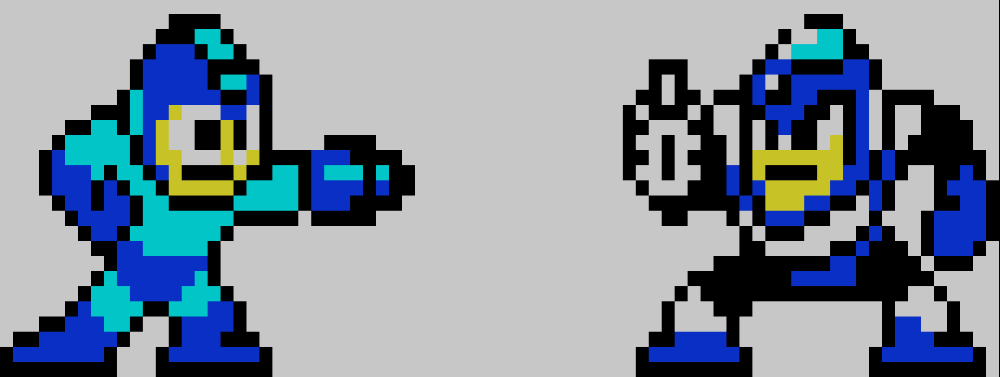
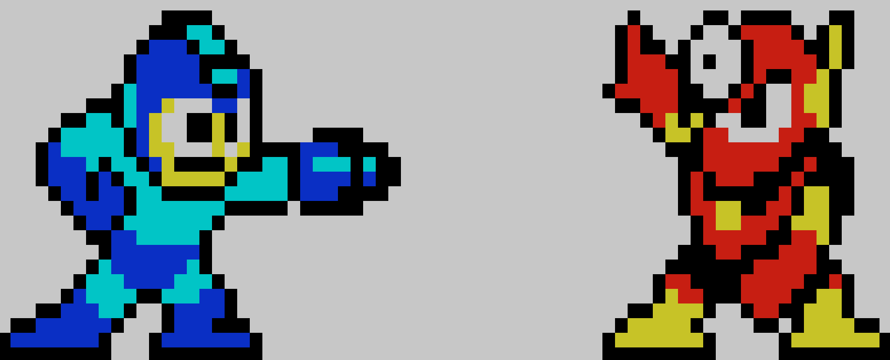
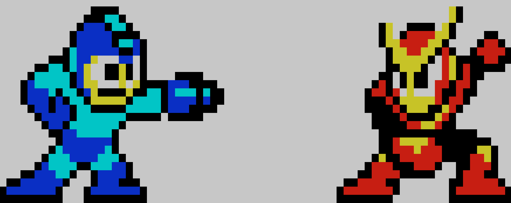

## 下記の gist を /etc/motd に貼り付けることで可能です
海外では megaman ですね  
今回は rockman 2 です  
ウッドマンはちょっと色的に厳しいのでリストラしました・・  
※debian系なら /etc/motd.tail にどうぞ  

### エアーマン


[gist:airman.txt](https://gist.githubusercontent.com/makocchi-git/10013320/raw/d911887525684dd02b31b27895d2700a08077f13/airman.txt)

### バブルマン


[gist:bubbleman.txt](https://gist.githubusercontent.com/makocchi-git/10013320/raw/a5cfdf8f6d8363c67de87e332f7551eb149f7cd7/bubbleman.txt)

### クラッシュマン


[gist:crashman.txt](https://gist.githubusercontent.com/makocchi-git/10013320/raw/f9f32927f82d8bbac913e2c6f5eb70dc30ff7603/crashman.txt)

### フラッシュマン


[gist:flashman.txt](https://gist.githubusercontent.com/makocchi-git/10013320/raw/6a3b9ae2f0a9447df7accd05be2f232b02e8c822/flashman.txt)

### ヒートマン


[gist:heatman.txt](https://gist.githubusercontent.com/makocchi-git/10013320/raw/5e9f160c4a5507dffe64d1084a3e7af8faabe879/heatman.txt)

### メタルマン


[gist:metaman.txt](https://gist.githubusercontent.com/makocchi-git/10013320/raw/7c1e616214e5cbef55402467e7298241ccb635a7/metalman.txt)

### クイックマン


[gist:quickman.txt](https://gist.githubusercontent.com/makocchi-git/10013320/raw/2a7f1dd1c5fd9fe64f837c41732f2c2aae6c6292/quickman.txt)

### こんな感じでどうぞ
```bash
$ curl -s <gistのurl> | sudo tee -a /etc/motd
```
